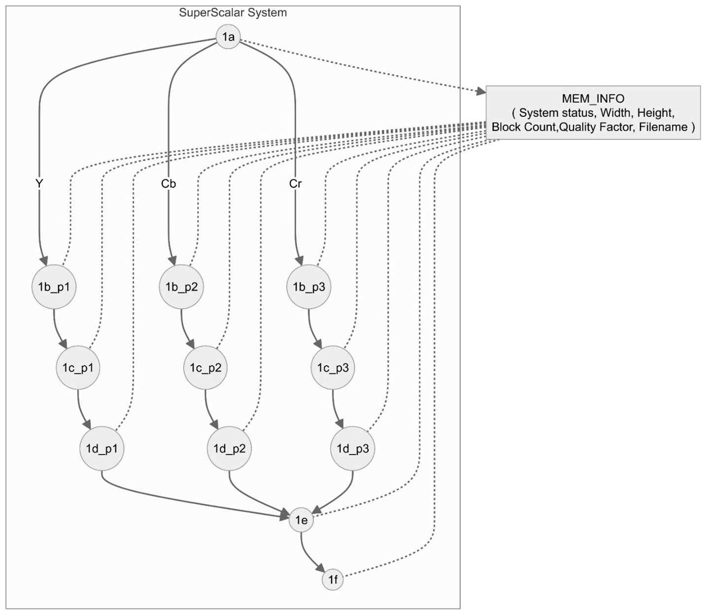
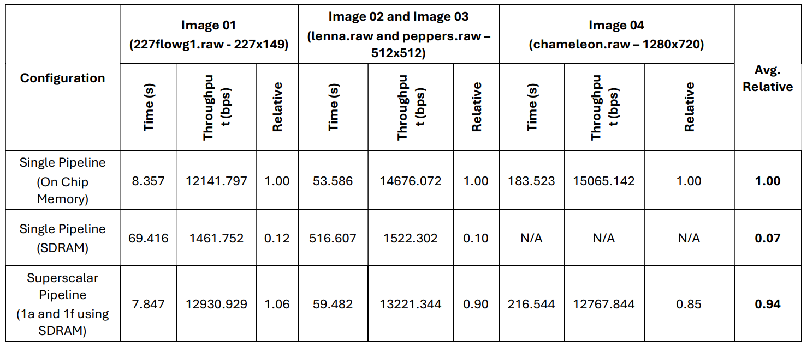

# 🚀 Pipelined JPEG MPSoC Encoder

This repository contains the source code and tools for a **Multi-Processor System-on-Chip (MPSoC)** implementation of a **pipelined JPEG encoder** on Intel/Altera FPGA platforms. Developed as part of a lab project for the CO503 Advanced Embedded Systems course, this project explores various hardware and software design strategies for optimizing JPEG encoding throughput.

## 📌 Project Overview

<!-- image -->


The encoder is implemented as a **6-stage pipeline**, each mapped to a separate CPU. Stages include:

1. **RGB to YCbCr conversion**
2. **Level shifting**
3. **DCT (Discrete Cosine Transform)**
4. **Quantization**
5. **Huffman encoding**
6. **Final JPEG output write**

The project evolved from a single pipelined system to an **optimized superscalar version**, which uses **parallel pipelines** for enhanced throughput—achieving over **1.3× performance** improvement.

## 📁 Folder Structure

```
├── software_simulated_pipeline/
│   └── Software simulation of pipelined JPEG encoder using file-based queues.
│
├── HARD_PREP/
│   └── Hardware-compatible version of software simulation using interfaces and OOP concepts.
│
├── HARDWARE/
│   └── FPGA implementation (single pipeline) using On-Chip Memory (Quartus II 13.1).
│
├── SUPERSCALAR_simulated_pipeline/
│   └── Simulated superscalar JPEG pipeline using multiple CPUs and file queues.
│
├── BASELINE_18/
│   └── Hardware implementation with SDRAM for code and On-Chip Memory for queues (Quartus Prime Lite 18.1).
│
├── MEM_MAP_GEN/
│   └── Python scripts for generating memory-mapped addresses using `sopcinfo` headers.
```

## 🔍 Key Features

* **Fully pipelined JPEG encoder with simulation and hardware implementations**
* **Object-oriented interface design in C for queues and devices**
* **Shared memory and file queue-based inter-processor communication**
* **Custom automation scripts for BSP/ELF generation and upload**
* **Optimized Nios II BSP configurations for minimal ELF footprint**
* **Dynamic memory mapping using Python + Bash automation**

## 🛠️ Technologies Used

* **Quartus II 13.1 / Quartus Prime Lite 18.1**
* **Nios II CPUs**
* **Bash + Python scripting**
* **C with hardware abstraction for embedded systems**

## 📊 Performance Summary

| Design Variant                   | Avg. Throughput Improvement |
| -------------------------------- | --------------------------- |
| Single Pipeline (On-Chip Memory) | 1.00×                       |
| Single Pipeline (SDRAM)          | 0.07×                       |
| Superscalar (Start & End stages in SDRAM)     | 0.94×          |
| Superscalar (Only start stage in SDRAM)   | **1.31×**          |

## 📎 In-Detail Performace Comparison

JPEG compression accuracy was verified with various RAW images (e.g., `lenna.raw`, `peppers.raw`, `chameleon.raw`), with compression and throughput results summarized below:

<!-- image -->


## 📚 References

* *Creating Multiprocessor Nios II Systems – ALTERA*
* *Nios II Software Developer’s Handbook – Intel*
* *Intel Embedded Design Handbook*
